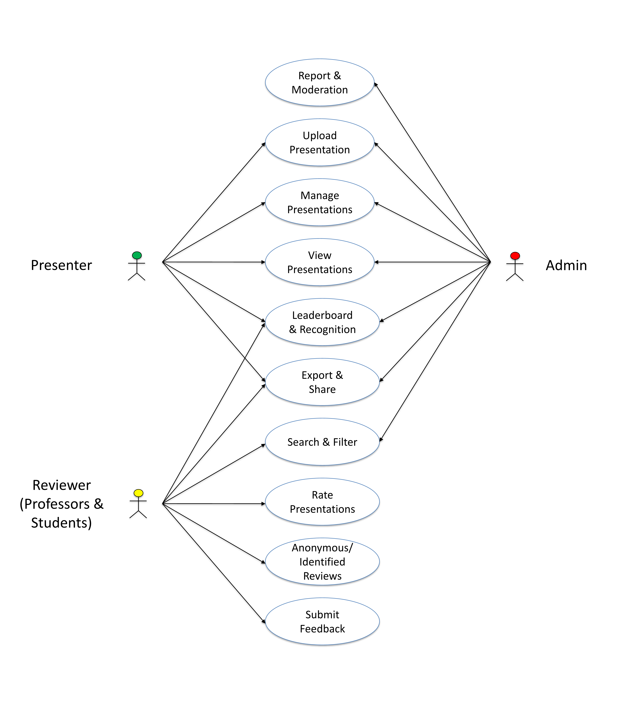
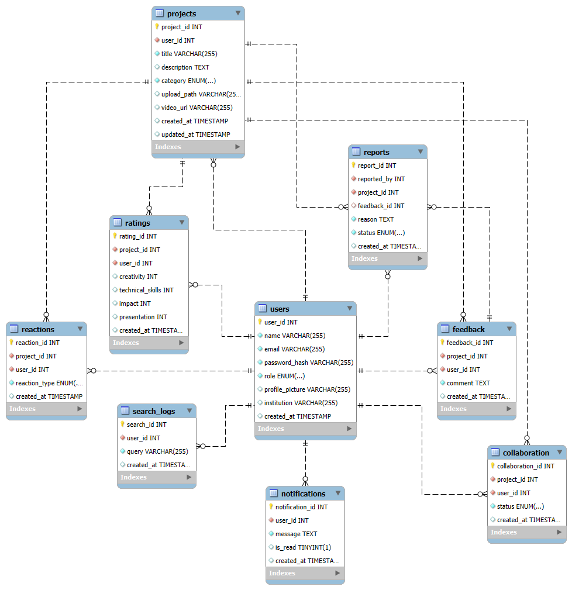

# CSC 6350 Software Engineering Project

## Course Info
- **Course:** CSC 6350 Software Engineering
- **Semester:** Spring 2025
- **Professor:** Dr. David James

## Group Member Names
- Kidus Tafa
- Naimul Islam
- Donggeun Yoo
- Cecilia Muniz Siqueira
- Jahin Al Hasan Joy

## Project Info
- **Title:** SPOT: Showcase, Post, Obtain Feedback, and Thrive 
- **Description:** This website is a platform designed to help students showcase their academic projects, receive ratings from peers and faculty, and gather constructive feedback to improve their work and thrive.

🚀 Features

1. Project Presentation & Management

Upload and organize academic presentations (PDF, PPT, embedded videos) for easy access.

Categorize projects based on topics, disciplines, or university courses.

2. Feedback & Rating System

Reviewers (students and professors) provide feedback through:

Comments for detailed discussions.

Emoji reactions for quick engagement.

Numerical ratings on clarity, research depth, and presentation quality.

A leaderboard highlights the top-rated projects to inspire motivation.

3. User Interaction & Collaboration

User profiles display academic backgrounds and uploaded projects.

Search and filter projects by topic, rating, or author.

Facilitates networking between students and faculty members.

🛠 Tech Stack

Backend: Django (Python)
Frontend: Vue.js
Database: MYSQL

## Use Case Diagram

## ER Diagram
