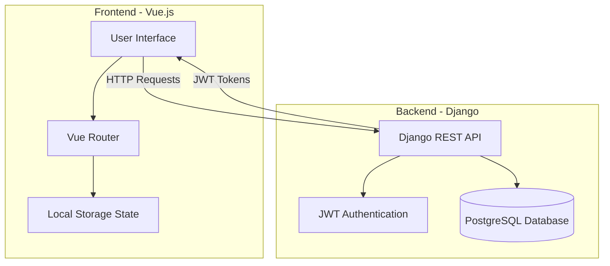
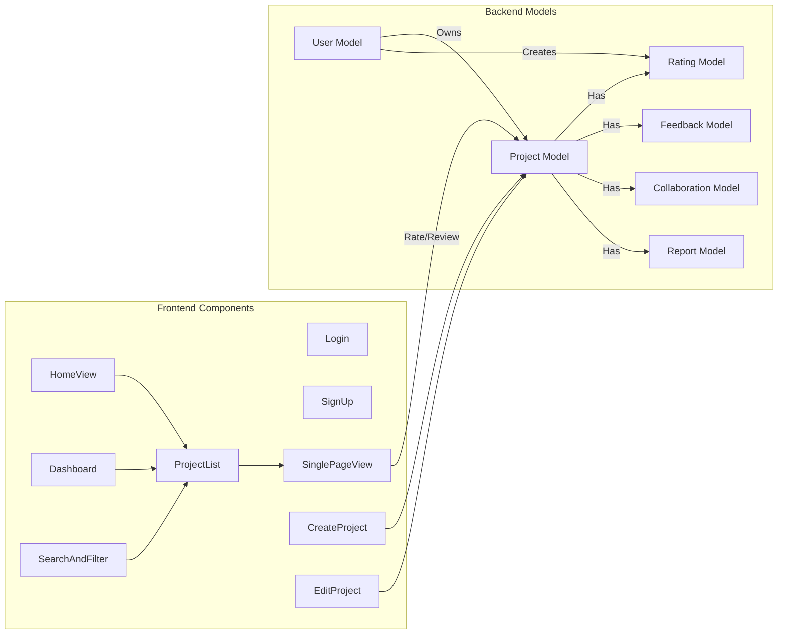
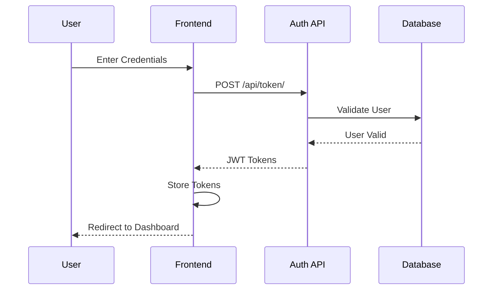
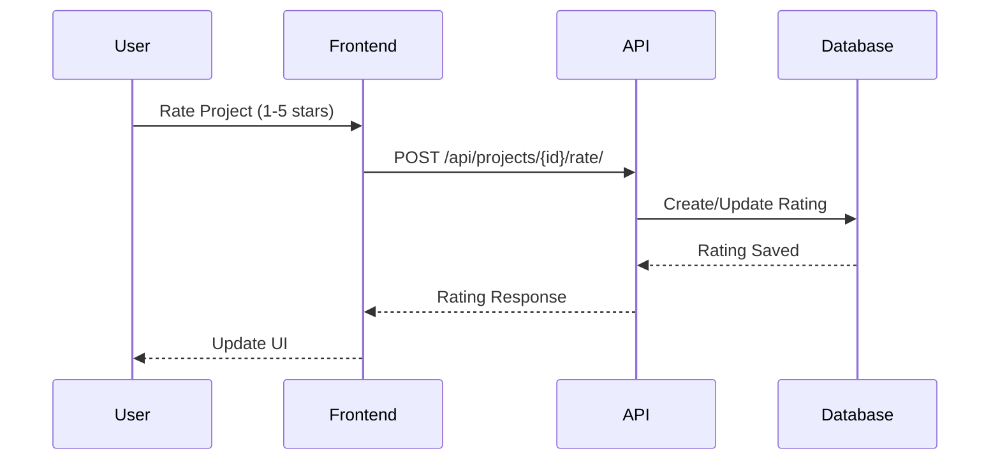

# SPOT System Architecture

## System Overview
SPOT (Student Project Overview Tool) is a web application that allows users to showcase, discover, and rate developer projects. Below are the system diagrams showing the architecture and component interactions.

## High-Level Architecture

## Component Diagram

## Authentication Flow

## Project Rating Flow

## Key Features

### Frontend
- Vue.js SPA with Vue Router
- JWT-based authentication
- Responsive UI with modern design
- Real-time rating updates
- Search and filtering capabilities

### Backend
- Django REST Framework API
- JWT authentication with SimpleJWT
- PostgreSQL database
- Custom user model
- Project management
- Rating system
- Search functionality

### Security Features
- JWT token authentication
- Protected API endpoints
- CORS configuration
- Password hashing
- Permission-based access control

## API Endpoints

### Authentication
- POST `/api/token/` - Get JWT tokens
- POST `/api/token/refresh/` - Refresh JWT token
- POST `/api/auth/signup/` - Register new user

### Projects
- GET `/api/projects/` - List all projects
- POST `/api/projects/` - Create new project
- GET `/api/projects/{id}/` - Get project details
- PUT `/api/projects/{id}/` - Update project
- DELETE `/api/projects/{id}/` - Delete project
- POST `/api/projects/{id}/rate/` - Rate project

### User
- GET `/api/user/projects/` - Get user's projects
- GET `/api/users/` - List users
- GET `/api/projects/search/` - Search projects 